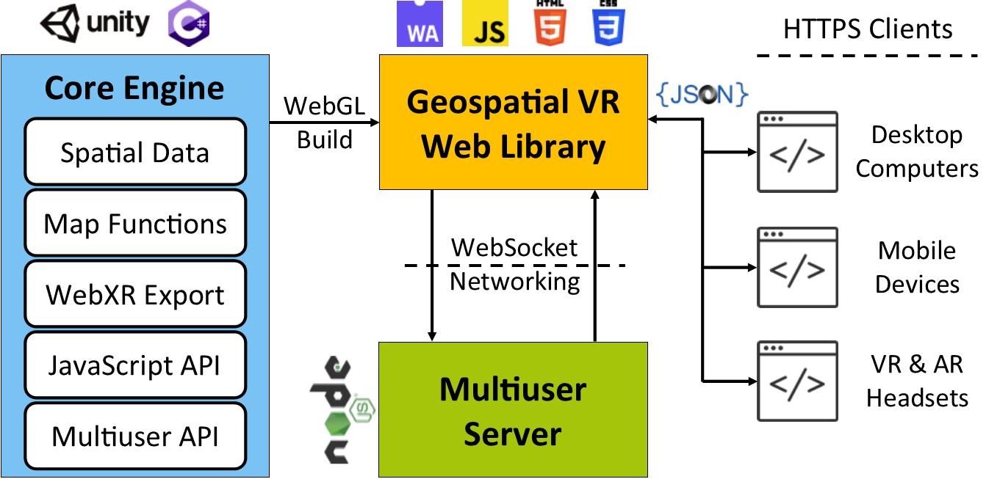
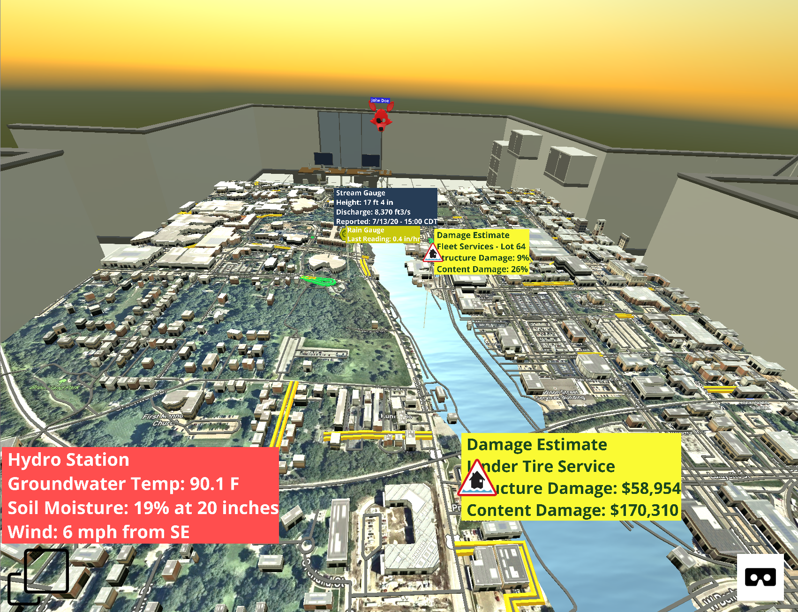

<p align="center"></p>

<h3 align="center">
  A Web-based Virtual Reality Framework for Collaborative Environmental Simulations
</h3>

<br>

## Table of Contents

- [Introduction](#introduction)
- [Computer Graphics & Virtual Reality Implementation](#computer-graphics--virtual-reality-implementation)
- [Parallel Programming Implementation](#parallel-programming-implementation)
- [How To Run](#how-to-run)
- [How To Use](#how-to-use)
- [Use Cases](#use-cases)
  - [Flood - Mumbai](#flood---mumbai-india)
  - [Forest Fire - Uttarakhand](#forest-fire---uttarakhand-india)
- [Feedback](#feedback)
- [To-Do](#to-do)
- [License](#license)
- [Acknowledgements & Citation](#acknowledgements--citation)

## Introduction

This project introduces GeospatialVR, an open-source collaborative virtual reality framework to dynamically create 3D real-world environments that can be served on any web platform and accessed via desktop and mobile devices and virtual reality headsets. The framework can generate realistic simulations of desired locations entailing the terrain, elevation model, infrastructures, dynamic visualizations (e.g. water and fire simulation), and information layers (e.g. disaster damages and extent, sensor readings, occupancy, traffic, weather). These layers enable in-situ visualization of useful data to aid public, scientists, officials, and decision-makers in acquiring a bird's eye view of the current, historical, or forecasted condition of a community. The framework incorporates multiuser support for remote virtual collaboration. GeospatialVR's purpose is to augment cyberinfrastructures with geospatial components to constitute the next-generation of information systems and decision support systems powered by immersive technologies. 

This India-specific implementation focuses on flood and forest fire disaster management scenarios, with case studies developed for flooding in Mumbai and forest fires in Uttarakhand. The project integrates **computer graphics and virtual reality** for immersive 3D visualization, combined with **parallel programming** for efficient data processing and machine learning-based disaster prediction.



---

## Computer Graphics & Virtual Reality Implementation

### 3D Rendering Pipeline

The project uses **Unity WebGL** as the core 3D graphics engine, implementing a complete computer graphics rendering pipeline:

1. **Geometry Processing**:
   - **Terrain Generation**: Real-world terrain is generated from elevation data and Google Maps tiles
   - **Building Rendering**: 3D buildings and infrastructure are procedurally generated from map data
   - **Coordinate Transformation**: Geographic coordinates (latitude/longitude) are converted to 3D world space coordinates

2. **Rasterization & Rendering**:
   - **WebGL Rendering**: Unity compiles to WebGL, utilizing the browser's GPU for hardware-accelerated rendering
   - **Shader Pipeline**: Custom shaders handle:
     - Water surface rendering (flood visualization)
     - Fire particle systems (forest fire simulation)
     - POI label rendering with billboarding (always face camera)
   - **Lighting & Shadows**: Real-time lighting calculations for realistic scene appearance

3. **Virtual Reality Integration**:
   - **WebXR API**: Implements WebXR standard for cross-platform VR support
   - **Head Tracking**: 6DOF (six degrees of freedom) head tracking for immersive navigation
   - **Stereoscopic Rendering**: Separate rendering for left/right eyes with proper IPD (interpupillary distance)
   - **Controller Support**: VR controller tracking for interaction in 3D space

4. **Dynamic Visualizations**:
   - **Water Simulation**: Procedural water mesh generation with animated surface for flood scenarios
   - **Particle Systems**: Fire effects using Unity's particle system with physics-based smoke and flames
   - **Information Overlays**: 3D text labels and icons positioned above terrain using world-space coordinates

### Graphics Technologies Used

- **Unity Engine**: 3D game engine providing rendering, physics, and scene management
- **WebGL**: Low-level graphics API for GPU-accelerated rendering in browsers
- **WebXR**: Standard API for VR/AR experiences in web browsers
- **GLSL Shaders**: Custom shader programs for water, fire, and visual effects
- **Three.js Integration**: WebGL wrapper utilities for 3D graphics operations

### VR Interaction Pipeline

```
User Input (VR Headset/Controllers)
    ↓
WebXR API (Browser)
    ↓
Unity WebGL (JavaScript Bridge)
    ↓
3D Scene Update (Camera Position, Object Transformations)
    ↓
GPU Rendering (WebGL Shaders)
    ↓
Display (VR Headset / Desktop Screen)
```

---

## Parallel Programming Implementation

### Parallel Data Processing Architecture

The project implements **parallel processing** to efficiently analyze large environmental datasets (10,000+ flood records) and predict disaster probabilities for Indian states.

### 1. Data Parallelism Strategy

**Chunking & Distribution**:
- Large datasets are divided into **chunks** based on available CPU cores
- Each chunk is processed independently in parallel
- Uses Python's `multiprocessing.Pool` for process-based parallelism

```python
# Data is split into N chunks (N = CPU cores)
chunks = [df.iloc[i:i+chunk_size] for i in range(0, len(df), chunk_size)]
# Process all chunks simultaneously
with Pool(n_workers) as pool:
    processed_chunks = pool.map(process_flood_chunk, chunk_data)
```

### 2. Parallel Feature Engineering

Each worker process independently:
- **Coordinate-to-State Mapping**: Geographic coordinates mapped to Indian states
- **Categorical Encoding**: Label encoding for land cover and soil type
- **Feature Calculation**: Risk indices, elevation-based risk factors computed in parallel
- **State Aggregation**: Disaster probabilities calculated per state

### 3. Machine Learning with Parallel Processing

- **Random Forest Training**: Uses `n_jobs=-1` to utilize all CPU cores for tree construction
- **Parallel Prediction**: State-wise probability predictions computed concurrently
- **Model Evaluation**: Cross-validation and accuracy metrics calculated in parallel

### 4. Performance Optimization

**Speedup Achieved**:
- **Sequential Processing**: Single-threaded, processes data row-by-row
- **Parallel Processing**: Multi-threaded, utilizes all CPU cores simultaneously
- **Typical Speedup**: 2.5x - 4x faster depending on CPU cores available

**Performance Metrics Tracked**:
- Parallel processing time
- Sequential processing time (for comparison)
- Speedup ratio
- CPU cores utilized
- Model accuracy

### 5. Parallel Processing Technologies

- **Python Multiprocessing**: Process-based parallelism (avoids GIL limitations)
- **Joblib**: Parallel execution utilities for scikit-learn
- **NumPy**: Vectorized operations for efficient array processing
- **Scikit-learn**: Parallel model training with `n_jobs` parameter

### Parallel vs Sequential Comparison

| Aspect | Sequential | Parallel |
|--------|-----------|----------|
| **Processing** | Row-by-row, single thread | Chunk-based, multi-threaded |
| **CPU Usage** | 1 core | All available cores |
| **Speed** | Baseline (1x) | 2.5x - 4x faster |
| **Memory** | Lower overhead | Higher (multiple processes) |
| **Use Case** | Small datasets | Large datasets (10K+ records) |

---

## How To Run

### Prerequisites

- Python 3.7 or higher
- Modern web browser (Chrome, Firefox, Edge) with WebXR support
- Optional: VR headset for immersive experience

### Step 1: Install Dependencies

```bash
pip install -r requirements.txt
```

This installs:
- `pandas` - Data manipulation
- `numpy` - Numerical computing
- `scikit-learn` - Machine learning
- `flask` - Web API server
- `flask-cors` - Cross-origin resource sharing

### Step 2: Start the API Server (Terminal 1)

The API server handles parallel processing and serves predictions:

```bash
python api_server.py
```

**Expected Output**:
```
Starting Disaster Prediction API Server...
API Endpoints:
  GET  /api/predictions - Get disaster predictions
  POST /api/predictions/refresh - Refresh predictions
  GET  /heatmaps.html - View heatmaps
 * Running on http://0.0.0.0:5000
```

The server will:
- Load and process flood.csv (10,000+ records) using parallel processing
- Train ML models for disaster prediction
- Calculate state-wise probabilities
- Serve results via REST API

### Step 3: Start the Web Server (Terminal 2)

The web server serves the VR interface and heatmaps:

```bash
python -m http.server 3000
```

**Expected Output**:
```
Serving HTTP on :: port 3000 (http://[::]:3000/) ...
```

### Step 4: Access the Application

**Main VR Interface**:
- Open browser: `http://localhost:3000`
- Click scenario buttons to view 3D flood/fire simulations
- Use VR headset for immersive experience (if available)

**Disaster Prediction Heatmaps**:
- Click "View State-wise Predictions" button on main page
- Or navigate directly: `http://localhost:3000/heatmaps.html`
- View parallel processing performance metrics
- See flood and forest fire risk predictions by state

### Quick Start (Windows)

Double-click `start_servers.bat` to automatically:
1. Install dependencies
2. Start API server (port 5000)
3. Start web server (port 3000)

### Quick Start (Linux/Mac)

```bash
chmod +x start_servers.sh
./start_servers.sh
```

### Troubleshooting

**Port Already in Use**:
- Change port in `api_server.py` (line 48): `app.run(port=5001)`
- Change port for web server: `python -m http.server 3001`

**API Connection Error**:
- Ensure API server is running on port 5000
- Check browser console for CORS errors
- Verify `flask-cors` is installed

**VR Not Working**:
- Use HTTPS or localhost (WebXR requires secure context)
- Enable WebXR in browser flags (Chrome: `chrome://flags/#webxr`)
- Check VR headset compatibility

## How To Use

This repository provides a boilerplate to use GeospatialVR. Simply download and run the "index.html".

To examine how the data is provided and visualizations are managed for the VR environment, check out [geospatialxr.js](script/geospatialxr.js)

As a brief summary of basic functionality:

- Load location on the map
```js
updateMapLocation(lat, lon, zoom); // default zoom is 16
```

Extend current map by loading more tiles
```js
extendMap(west, east, north, south); // for initial map, 1 tile is loaded per each direction
```

Enable traffic layer on active map
```js
enableTraffic();
```

Add points of interest with labels on the map
```js
var pois = {"pois": [
                {"lat": 19.0596, 
                  "lon": 72.8295, 
                  "type": "StreamSensor", 
                  "height": 85,
                  "content": "Mithi River Gauge\nHeight: 2.5 m\nDischarge: 450 m³/s"},
                {"lat": 19.0610, 
                  "lon": 72.8310, 
                  "type": "RainGauge", 
                  "height": 70,
                  "content": "IMD Rain Gauge\nLast Reading: 25 mm/hr\nMonsoon Alert: Active"},
      ]};
addPOI(pois);

// Type parameter refers to the label styling. Currently available label types:
// Warning, SensorGeneric, StreamSensor, RainGauge, Soil, Damage, Fireman, FireData
```

Add fire animation to given location(s)
```js
var firePOIs = {"pois": [
                {"lat": 30.3165,
                  "lon": 79.0193,
                  "height": 0},
      ]};
generateFire(firePOIs);
```

## Use Cases

### Flood - Mumbai, India

A case study for flood management in Mumbai, India, showing a flood animation and relevant data layers (i.e. Mithi River gauges, IMD rain gauges, hydro stations for groundwater and soil moisture data, estimated flood damages in Indian Rupees (₹) for current or forecasted flood scenarios, and traffic congestion). Mumbai is prone to monsoon flooding, particularly in the Mithi River area.

Flooding Use Case - Mumbai
:-------------------------:


### Forest Fire - Uttarakhand, India

A case study for forest fire management in Uttarakhand, India, showing a fire animation and relevant data layers (i.e. characteristics and center of the forest fire, evacuation requirements for nearby villages, air quality and PM2.5 measurements in the area, forest officer vitals, and traffic congestion). Uttarakhand's Himalayan forests are prone to fires during dry seasons.

Forest Fire Use Case - Uttarakhand
:-------------------------:


## Feedback

Feel free to send us feedback by filing an issue.

## To-Do

This framework is currently a functioning prototype, and is not suitable for use at an operational level. 

- Allow users to create rooms for multiuser.
- Race condition exists when multiple users interact at the same environment.
- Always initialize the map at the same location in the virtual room regardless of the location's elevation.
- Allow developers to create custom POI labels by providing color, icon, and font through JS.
- and more...

## License

This project is licensed under the MIT License - see the [LICENSE](LICENSE) file for details.

## Acknowledgements & Citation

This project is developed by the University of Iowa Hydroinformatics Lab (UIHI Lab): [https://hydroinformatics.uiowa.edu/](https://hydroinformatics.uiowa.edu/).

This project utilizes Mapbox Unity SDK and Mozilla Unity WebXR Exporter.

> Sermet, Y. and Demir, I., 2021. GeospatialVR: A web-based virtual reality framework for collaborative environmental simulations. Computers & Geosciences, p.105010. https://doi.org/10.1016/j.cageo.2021.105010

> Sermet, Y. and Demir, I., 2020, November. An Immersive Decision Support System for Disaster Response. In 26th ACM Symposium on Virtual Reality Software and Technology (pp. 1-3). https://doi.org/10.1145/3385956.3422087
